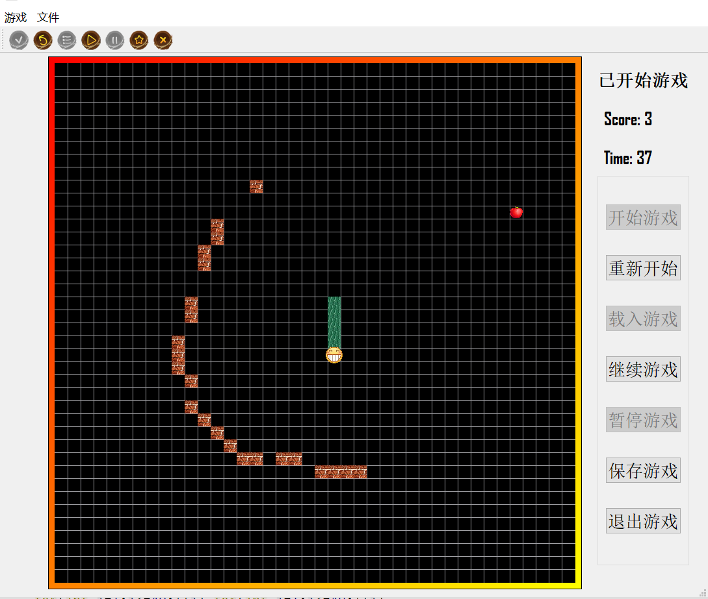

# game-snake
A snake game made with QT.

My homework when I was freshman.  The code is nearly **unreadable**, but I don't want to change it. 

There's no release version. If you **really** want to play it, use Qt to open the project and build it please.  （After all, no one will see this project :)

```
QT 5.13.0
Desktop Qt 5.13.0 MinGW 64-bit
```

Before the game starts, use the mouse to click to place obstacles. Use the up, down, left, and right keys to move. The seven buttons are: start game, restart, load, continue, pause, save, quit.



